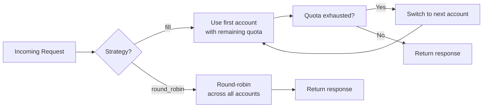
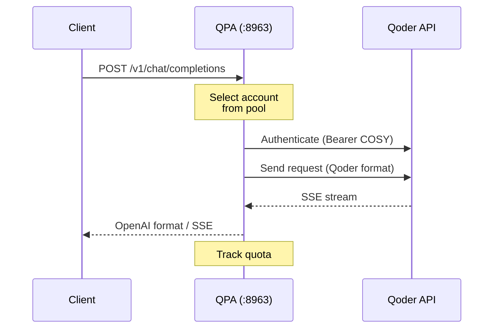
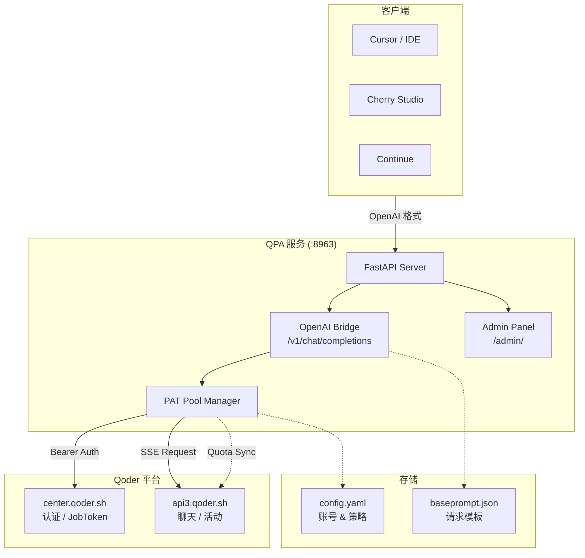
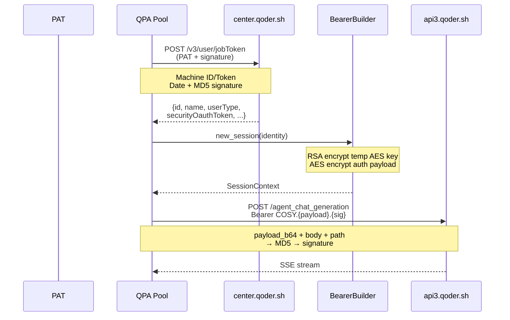
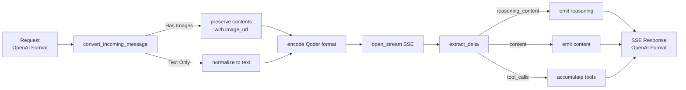

<p align="center">
  
</p>

<p align="center">
  <strong>OpenAI 兼容接口 · 多账号智能调度 · 视觉模型支持 · 思考过程透传 · Web 管理面板</strong>
</p>

<p align="center">
  <a href="#quick-start">快速开始</a> ·
  <a href="#configuration">配置</a> ·
  <a href="#api-reference">API</a> ·
  <a href="#web-ui">管理面板</a> ·
  <a href="#deployment">部署</a> ·
  <a href="#architecture">架构</a>
</p>

<br>

QPA 将 Qoder 的私有 API 协议转换为标准的 OpenAI `v1/chat/completions` 接口，同时提供多 PAT 账号池管理、智能额度感知调度、多模态视觉理解、思考过程透传等能力，并附带一个内置的 Web 管理面板。

无论是用于 Cursor、Cherry Studio、Continue 等 AI 客户端，还是作为自建网关，QPA 都能即插即用。

---

## 特性

**零成本迁移** — 兼容 OpenAI 的 `/v1/chat/completions` 和 `/v1/models` 接口，客户端只需修改 base URL。

**多账号池** — 通过 `config.yaml` 管理任意数量的 PAT，支持实时启停，无需重启服务。

**两种调度策略**



| 策略 | 行为 |
|---|---|
| `fill` | 按顺序使用账号，当前账号免费额度耗尽后自动切换到下一个，最大限度利用每个号的免费调用次数 |
| `round_robin` | 每次请求按顺序轮换，均匀分摊负载 |

**额度感知** — 自动通过 `/algo/api/v2/activity` 接口查询每个账号的剩余免费调用次数，额度耗尽自动跳过，0 点重置后自动恢复。

**视觉理解** — 原生支持 OpenAI 多模态格式，`data:image/...;base64,...` 内联图片无需上传直接透传，模型自动识别。

**思考过程** — `reasoning_content` 字段完整透传，流式与非流式输出均支持，与 DeepSeek 格式兼容，主流客户端自动折叠显示。

**Tool Calling** — 完整的 function calling 支持，含流式 tool calls 累积和文本回退解析。

**管理面板** — 内置 Web UI，可视化查看所有账号的状态、额度进度条、调度策略切换、账号增删。

---

## Quick Start

### 前置要求

- Python 3.11+
- Qoder PAT（在 [qoder.sh](https://qoder.sh) 账号设置 → 创建 Personal Access Token）

### 本地运行

```bash
git clone https://github.com/your/qpa.git
cd quoda/qpa

python -m venv .venv
source .venv/bin/activate
pip install -r requirements.txt

# 编辑 config.yaml，填入你的 PAT
vim config.yaml

python run.py
```



服务启动后访问：

| 用途 | 地址 |
|------|------|
| API 端点 | `http://localhost:8963/v1/chat/completions` |
| 模型列表 | `http://localhost:8963/v1/models` |
| 管理面板 | `http://localhost:8963/admin/` |

### 客户端配置

以 Cursor / Cherry Studio / Continue 为例：

```
API Base URL:  http://localhost:8963/v1
API Key:       任意值（QPA 不校验，留空即可）
Model:         qmodel_latest 或 lite
```

---

## Configuration

### config.yaml

```yaml
server:
  host: "0.0.0.0"
  port: 8963

accounts:
  - name: main
    pat: "pt-xxxxxxxxxxxxxxxxxxxxxxxxxxxxxxxxxxxxxxxx"
    enabled: true
  - name: backup
    pat: "pt-yyyyyyyyyyyyyyyyyyyyyyyyyyyyyyyyyyyyyyyy"
    enabled: true

strategy: "fill"  # fill | round_robin

models:
  default_context_length: 1000000
  list:
    - id: lite
      display_name: Lite
      owned_by: qoder
    - id: qmodel_latest
      display_name: Qwen3.7-Max
      owned_by: qoder
```

| 字段 | 类型 | 说明 |
|------|------|------|
| `server.host` | string | 监听地址 |
| `server.port` | integer | 监听端口 |
| `accounts[].name` | string | 账号显示名称（仅面板用） |
| `accounts[].pat` | string | Qoder Personal Access Token |
| `accounts[].enabled` | bool | 是否启用 |
| `strategy` | string | `fill` 或 `round_robin` |
| `models.default_context_length` | integer | 上下文窗口大小 |
| `models.list` | array | 模型列表定义 |

---

## API Reference

### `POST /v1/chat/completions`

完全兼容 OpenAI Chat Completions API。

**请求参数：**

| 参数 | 类型 | 默认 | 说明 |
|------|------|------|------|
| `model` | string | `lite` | 模型 ID |
| `messages` | array | - | 对话消息，支持多模态 content |
| `stream` | boolean | `false` | SSE 流式输出 |
| `tools` | array | - | Tool calling 定义 |

**非流式响应：**

```json
{
  "id": "chatcmpl-abc123",
  "object": "chat.completion",
  "created": 1700000000,
  "model": "qmodel_latest",
  "choices": [{
    "index": 0,
    "message": {
      "role": "assistant",
      "content": "你好！有什么我可以帮你的吗？",
      "reasoning_content": "用户用中文打招呼，简单问候即可。"
    },
    "finish_reason": "stop"
  }],
  "usage": {
    "prompt_tokens": 0,
    "completion_tokens": 0,
    "total_tokens": 0
  }
}
```

**流式响应（SSE）：**

```
data: {"id":"chatcmpl-xxx","object":"chat.completion.chunk","choices":[{"index":0,"delta":{"role":"assistant","reasoning_content":"用户"},"finish_reason":null}]}
data: {"id":"chatcmpl-xxx","object":"chat.completion.chunk","choices":[{"index":0,"delta":{"reasoning_content":"用中文打招呼"},"finish_reason":null}]}
data: {"id":"chatcmpl-xxx","object":"chat.completion.chunk","choices":[{"index":0,"delta":{"content":"你好！"},"finish_reason":null}]}
data: {"id":"chatcmpl-xxx","object":"chat.completion.chunk","choices":[{"index":0,"delta":{},"finish_reason":"stop"}]}
data: [DONE]
```

`reasoning_content` 和 `content` 分别对应思考过程和正式回复，客户端可根据字段名分别渲染。

### 图片输入

原生的 OpenAI 多模态格式，base64 图片直接透传，无需上传步骤：

```bash
curl http://localhost:8963/v1/chat/completions \
  -H "Content-Type: application/json" \
  -d '{
    "model": "qmodel_latest",
    "messages": [
      {
        "role": "user",
        "content": [
          {"type": "text", "text": "描述这张图片"},
          {"type": "image_url", "image_url": {"url": "data:image/png;base64,iVBORw0KGgoAAAANSUhEUg..."}}
        ]
      }
    ]
  }'
```

支持 `data:` 内联 base64 和 `https://` 远程 URL 两种方式。

### `GET /v1/models`

```json
{
  "object": "list",
  "data": [
    {"id": "lite",         "object": "model", "owned_by": "qoder"},
    {"id": "qmodel_latest","object": "model", "owned_by": "qoder"}
  ]
}
```

---

## Web UI

管理面板位于 `http://localhost:8963/admin/`：

- **额度总览** — 卡片展示总剩余次数、活跃账号数、总请求数
- **账号卡片** — 每个账号独立卡片，显示用户信息、计划类型、额度进度条、剩余/总量
- **调度策略** — 一键在 `fill` 和 `round_robin` 之间切换
- **账号管理** — 添加、删除、启用/停用账号，支持 PAT 掩码显示
- **自动刷新** — 每 30 秒自动同步最新额度数据

---

## Deployment

### Docker Compose（推荐）

```bash
# 1. 编辑 config.yaml 填入你的 PAT
# 2. 启动
docker compose up -d

# 查看日志
docker compose logs -f

# 重启
docker compose restart

# 停止
docker compose down
```

`config.yaml` 和 `baseprompt.json` 通过 volume 挂载，容器内不打包配置文件，升级镜像时配置不受影响。

### Build & Run

```bash
docker build -t qpa .
docker run -d \
  --name qpa \
  -p 8963:8963 \
  -v $(pwd)/config.yaml:/app/config.yaml \
  -v $(pwd)/baseprompt.json:/app/baseprompt.json \
  -e TZ=Asia/Shanghai \
  --restart unless-stopped \
  qpa
```

### Environment

| 变量 | 默认 | 说明 |
|------|------|------|
| `TZ` | `Asia/Shanghai` | 时区 |

> QPA 本身不再读取环境变量配置，所有设置通过 `config.yaml` 完成。

---

## Updating

```bash
# ── 本地 ──
git pull
source .venv/bin/activate
pip install -r requirements.txt --upgrade
python run.py

# ── Docker ──
git pull
docker compose build --no-cache
docker compose up -d
```

> `config.yaml`、`baseprompt.json` 不受更新影响。Docker 部署下通过 volume 挂载，升级镜像后配置保留。

---

## Architecture

### 组件架构



### 认证流程



### 数据流



---

## Project Structure

```
QPA/
├── run.py              # 启动入口
├── main.py             # FastAPI 应用、路由、WebUI HTML
├── pool.py             # PAT 池管理、额度查询、策略调度
├── qoder_client.py     # Qoder API HTTP 客户端（保留原版签名）
├── bearer.py           # RSA/AES 加密、Session、Bearer Token
├── encoding.py         # Qoder 自定义 Base64 编解码
├── signature.py        # 请求签名（MD5 + Date）
├── config.yaml         # 配置文件
├── baseprompt.json     # Qoder 请求体模板
├── Dockerfile          # Docker 构建
├── docker-compose.yaml # Docker Compose 编排
├── requirements.txt    # Python 依赖
└── README.md
```

---

## Acknowledgements

QPA 是对 [cubk1/qoder2api](https://github.com/cubk1/qoder2api) 的完整重构与功能增强。感谢原项目的逆向分析与思路启发，QPA 在其基础上实现了多账号池、视觉支持、思考过程透传、管理面板等增强功能。

Qoder 平台由 [qoder.sh](https://qoder.sh) 提供算法能力。

---

<p align="center">
  <sub>Built with care. Licensed under MIT.</sub>
</p>
